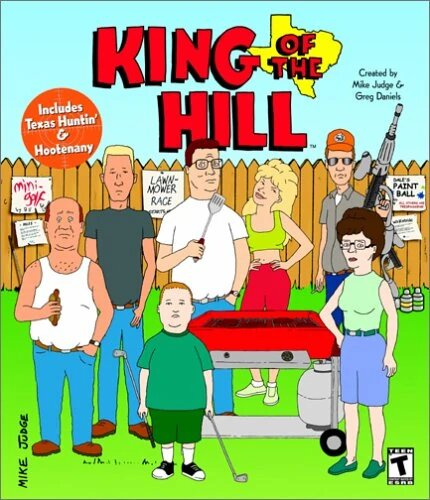

# King-of-the-Hill Game

              
L'adresse du contract : 0x98B384C8971c85c1557eC83B9F585968aAD3DB42

Bob adresse : 0xe5F6bABf4600E5c5C2Ff3C6400e5f8c16A0BB7AB  ===> 1er joueur a jouer aux 1er tour. 

Alice adresse : 0xc0f851203ac00f85893Af5207234755035e53b31 ===> Owner du contract. 

Jean adresse : 0xe5F6bABf4600E5c5C2Ff3C6400e5f8c16A0BB7AB ===> King du 1er tour.

ewe adresse :  0xc945d3B93b056507CB79a9DcD2D143EA736f75A8 ==> 1er joueur du tour suivant

TestNet : Rinkeby.
## Énoncer du jeu : 

king of the hill est un jeu où les joueurs doivent acquérir le contenu d'un pot qui contient de l'ether, en envoyant le double de ce que contient le pot au moment de la transaction, dans le temps impartit. La limitte de temps  est définie au préalable par le maitre du jeu.  Une fois le temps arrivée à son terme, le Roi (vainqueur) reçoit le pot une fois le tour suivant (partie) lancée. 

## Les régles et conditions du jeu : 

Le joueur qui envoie le double du pot actuel devient le King.
A chaque fois qu'un joueur mise, la durée de la partie est renouvelée. 
Si le King arrive à garder sa couronne pendant un certain nombre de blocs alors : 
  - 10% sont envoyés à l'owner du smart contract.
  - Le King gagne 90% du reste du pot.
  - Le reste du pot servira pour le tour suivant. 
Le King recoit alors ces gains une fois le tour suivant lancée. 
Si le 1er joueur du tour suivant, envoie un surplus, alors il reçoit automatiquement le surplus. 

## Explication de certaine partie du code : 
### `Le Constructor :` 
Le code se trouvant dans le constructore est traité uniquement lors du déploiement du contract. Il sert de base de fonctionnement du contract. 
Lors du déploiement du contract, le owner devra définir le montant de la taxe qu'il décide d'instaurer; ainsi qu'aux bout de combien de difference de block, avec celle de la derniere transaction (_currentBlock), le tour se termine (_finalBlock). 

    constructor(uint256 tax_, uint256 finalBlock_) payable {
          _owner = msg.sender;
          _tax = tax_;
          _bet = msg.value;
          _finalBlock = finalBlock_;
          _currentBlock = block.number;
      }

### `Fonction ToBeTheKing :`
Ce smart contract détient une fonction principal, qui regroupe presque toutes les règles du jeu.
La fonction ToBeTheKing peut-être appelée par n'importe qui, tant qu'il respect 2 conditions:
 - 1er condition: le joueur doit misé (envoyer)  double du pot (_bet) actuel.
 - 2eme condition: Ne peut miser le joueur qui est actuellement le King.  

      function firstPlc(uint256 currentBet) public payable {
        require(
            currentBet == (_bet * 2),
            "KingHill: your bet must be egual to  muliply the balance * 2."
        ); 
        require(msg.sender != _TheKing, "KingHill: you are alreday the king"); 

  
Dans cette fonction, nous avons ensuite une condition If/else. Elle contient la condition pour remporter la partie. Si le block actuel - (moins) le numéro du block à laquelle où le dernier joueur est devenue king, est > (supérieur) au block final (le numéro du block à laquelle où le dernier joueur est devenue king + le nombre de block définit par le maitre du jeu(owner)); alors : 
  
  - Calcul le montant de la taxe (fee);
  - On retire le montant de la taxe du pot (_bet). 
  - On envoie le montant de la taxe prélevé à la balance du Owner (_gainOwner)

    uint256 fee = (_bet * 2) / 100; 
            _bet -= fee;
            _gainOwner += fee;

 

 - On calcul le montant à envoyer au King (soit 90% de la balance; le reste pour le prochain tour);
 - On décremente les gains du vainqueur de la balance du jeu;
 - On décremente les gains du vainqueur de la balance du jeu
 - On envoie au King ces gains. 
    
      uint256 amountWinner = (_bet - ((_bet * 10) / 100)); 
      _bet -= amountWinner; 
      payable(_TheKing).sendValue(amountWinner); 

- Calcul du surplus envoyé par le nouveau joueur; (msg.value = montant envoyer par le joueur qui lance le nouveau tour)
- On incrémente le pot (_bet) du montant envoyer;
- On décremente le pot (_bet) du surplus calculé précedement. 
- On Renvoie le surplus à son propriétaire. 

      uint256 extra = msg.value - (_bet * 2); 
      _bet += msg.value;
      _bet -= extra;
      payable(msg.sender).sendValue(extra); 
      } 

Tant que la partie (tour) n'est pas fini, alors on accepte tout parie. Et on incremente le pot (_bet) de la mise (msg.value) du joueur.

    else {
            _bet += msg.value; // incremente la balance du jeu a chque envoie d'une mise.
        }

Enfin, à chaque fois que la fonction est appélée, alors on met à jour, le nouveau King, et, la durée de la partie (_currentBlock)  

    _TheKing = msg.sender; 
    _currentBlock = block.number; 
    }

### `Fonction WithdrawGain :` 
Cette fonction permet au maitre du jeu (_owner) de retirer, lorsqu'il le désire, ces profits. 

    function withdrawGain() public {
        require(msg.sender == _owner, "Only owner can withdraw gain");
        uint256 taxProfit = _gainOwner;
        _gainOwner = 0;
        payable(_owner).sendValue(taxProfit);
    }

### `Les Fonctions View :` 
Les fonctions view servent à lire des informations inscrit sur la blockchain. 

La fonction tax permet de lire la taxe actuel appliqué par le maitre du jeu (_owner), pour ce tour. 

    function tax() public view returns (uint256) {
        return _tax;
    }

La fonction _bet permet de lire la balance du pot (_bet), afin de connaitre le montant à miser. 

    function bet() public view returns (uint256) {
        return _bet;
    }

La fonction TheKing permet de lire l'adresse du king (gagnant) du tour actuel.

    function TheKing() public view returns (address) {
        return _TheKing;
    }

La fonction owner permet de lire l'adresse du maitre du jeu (_owner)

    function owner() public view returns (address) {
        return _owner;
    }

La fonction seeGains permet de lire la balance actuel du maitre du jeu (_owner)

    function seeGains() public view returns (uint256) {
        return _gainOwner;
    }

La fonction blockNumber permet de lire le numéro du block en cour. 

    function blockNumber() public view returns (uint256) {
        return block.number;
    }

La fonction TimeOut permet de lire si le tour est fini (true) ou toujours en cour (false)

    function TimeOut() public view returns (bool) {
      return (block.number - _currentBlock) > _finalBlock ? true : false;
    }

